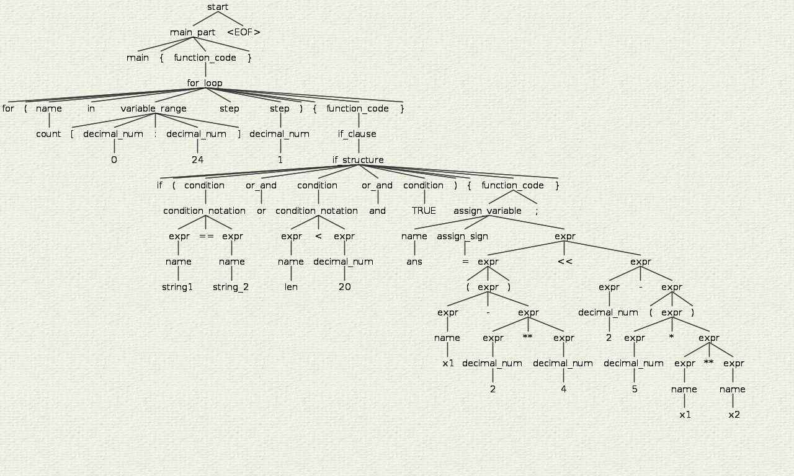

# BGrammar!

BGrammar (which is a combination of Behzad + Grammar) is an imaginary grammar developed in ANTLR. The supported syntax is a combination of `c++`, `Python`, `Golang`, and also some new structures!

## Quick Setup
To be able to run the grammar, you should provide its prerequisites in advance. Following instructions are adopted from [ANTLR](https://www.antlr.org/) web-page: 
### Linux:
	$ cd /usr/local/lib
	$ sudo wget https://www.antlr.org/download/antlr-4.9-complete.jar
	$ export CLASSPATH=".:/usr/local/lib/antlr-4.9-complete.jar:$CLASSPATH"
	$ alias antlr4='java -jar /usr/local/lib/antlr-4.9-complete.jar'
	$ alias grun='java org.antlr.v4.gui.TestRig'
You can also find the instruction for OS X and Windows in the mentioned web-page.

## How to run it?

After providing prerequisites, you only need to type following lines in the terminal:

	$ antlr4 BGrammar.g4
	$ javac BGrammar*.java
	$ grun BGrammar start -gui
	$ <input_expression>
	$ ^D 
But feeding the input manually each time is a pain in the rear, isn't it? So try pipping the input:

	$ antlr4 BGrammar.g4
	$ javac BGrammar*.java
	$ cat input.txt| grun BGrammar start -gui

## How does it look?
Here is an example illustrating how a parse-tree looks (and also you can see it excellently took precedence over various operators):

